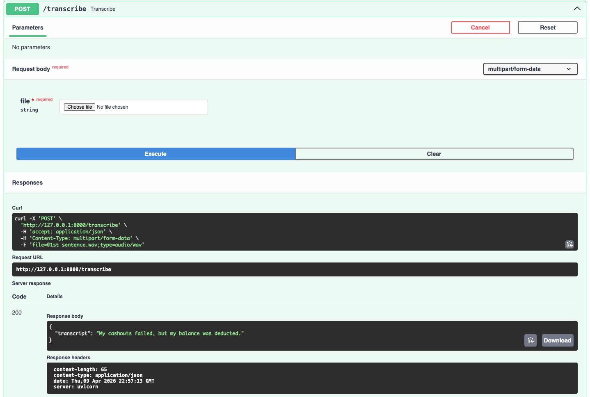
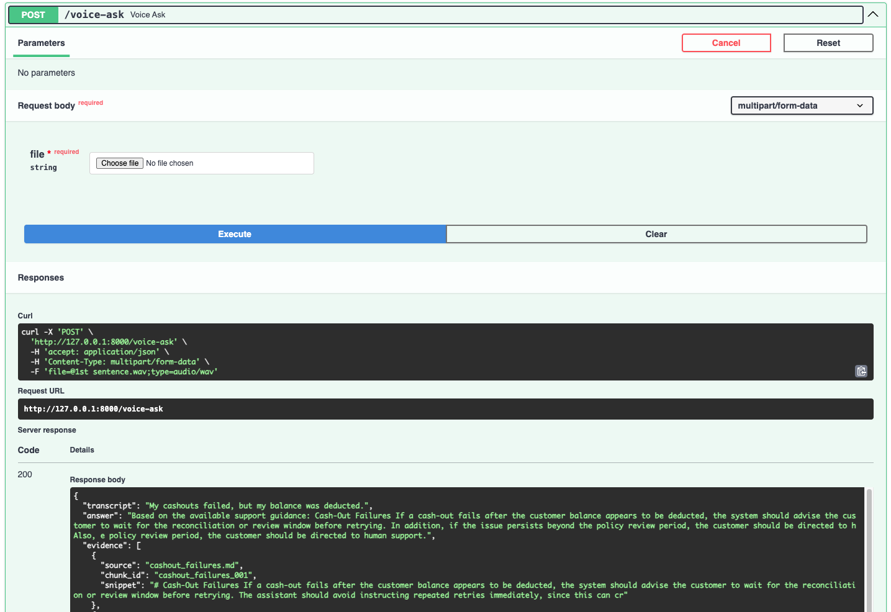
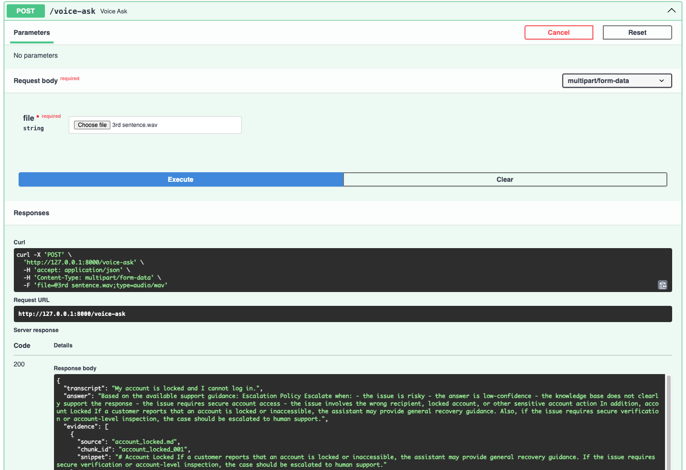
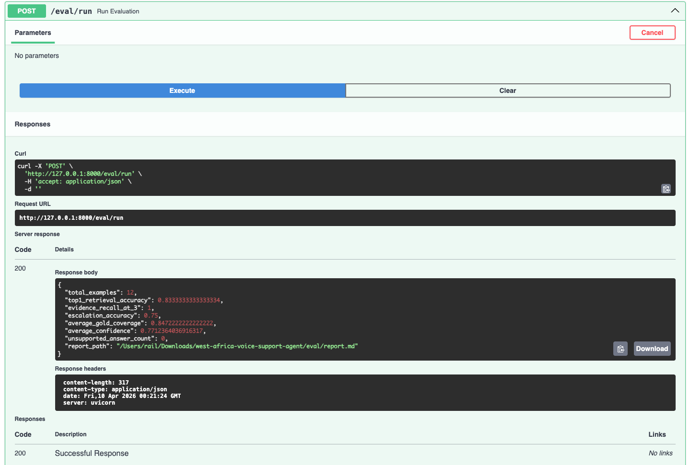

# West Africa Voice Support Agent

A production-minded voice support agent for low-resource customer support scenarios in West Africa.

This project demonstrates how to build a safer, grounded support workflow that accepts audio or text, retrieves evidence from a support knowledge base, generates concise responses, and escalates risky or unsupported cases to a human agent.

## Why this project matters

Many customer support environments in African markets operate under constraints that are often missing from mainstream AI demos:

- multilingual and code-switched user input
- noisy audio conditions
- informal phrasing and spelling variation
- low-bandwidth or unstable connectivity
- trust-sensitive financial and account-related issues
- limited tolerance for unsupported or risky responses

This repo is a focused demonstration of how to design a support assistant for that setting.

## What this project shows

This system implements a narrow but realistic support pipeline:

1. Accept voice or text input
2. Transcribe audio locally
3. Normalize the user query
4. Retrieve relevant support documents
5. Generate a response grounded in retrieved evidence
6. Estimate confidence and detect risky cases
7. Either return an evidence-backed answer or recommend escalation

The goal is not open-ended chatting. The goal is reliable support behavior in settings where grounding, fallback logic, and escalation matter.

## Current evaluation snapshot

- **Top-1 retrieval accuracy:** 83.3%
- **Evidence recall@3:** 100.0%
- **Average gold coverage:** 84.7%
- **Escalation accuracy:** 75.0%
- **Average confidence:** 0.771
- **Unsupported answers:** 0

## Example supported intents

- send money failed
- cash-out issue
- account locked
- wrong recipient
- KYC / identity verification help

## Core features

- **Voice and text support**
- **Local offline transcription with `faster-whisper`**
- **Hybrid retrieval**
  - domain-aware lexical retrieval
  - TF-IDF retrieval
  - hybrid reranking
- **Grounded answer generation**
- **Evidence-backed responses**
- **Confidence-aware fallback**
- **Escalation for risky or unsupported cases**
- **Offline evaluation suite**
- **Modular Python backend**

## Demo assets

## Screenshots

<p align="center">
  
</p>

<p align="center">
  
</p>

<p align="center">
  
</p>

<p align="center">
  
</p>

## Demo video

[Watch the demo video](samples/demo/voice-support-demo.mp4)

## Voice transcription

The system supports local offline speech transcription using `faster-whisper`.

### API endpoints

- `POST /transcribe` — upload audio and receive a transcript
- `POST /voice-ask` — upload audio and run the full support pipeline

### ASR configuration

- **Backend:** `faster-whisper`
- **Model size:** `small`
- **Device:** `cpu`
- **Compute type:** `int8`

### Note

The first transcription request may take longer because the ASR model is loaded on first use.

## System architecture

```text
User input
  ├─> text
  └─> voice
        └─> local ASR (faster-whisper)

Normalized query
  └─> hybrid retrieval
        ├─> lexical retrieval
        ├─> TF-IDF retrieval
        └─> reranking

Retrieved evidence
  └─> grounded answer generation
        └─> guardrails
              ├─> confidence check
              ├─> risky-intent detection
              └─> escalation decision

Final output
  ├─> evidence-backed response
  └─> escalation to human support
